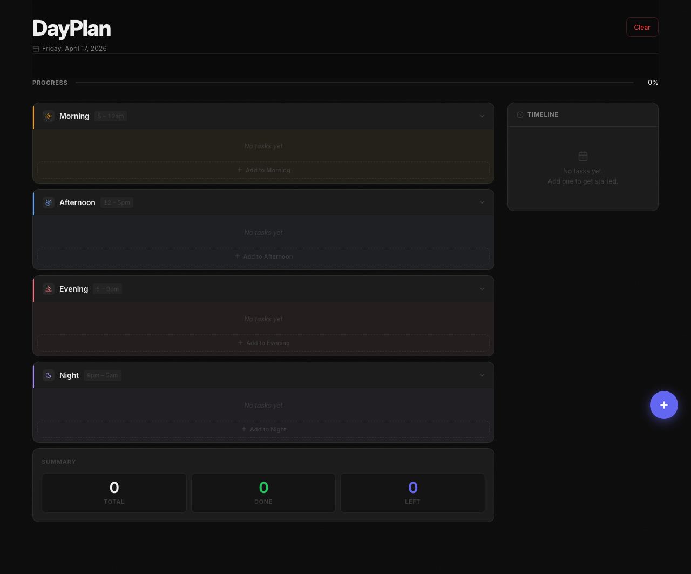

# DayPlan — Daily Itinerary

A minimal, premium dark-theme daily planner that lives in a single HTML file. No build step, no framework, no dependencies.



## Live Demo

[https://ahaanasubberwal-cpu.github.io/to-do-list/](https://ahaanasubberwal-cpu.github.io/to-do-list/)

## Features

- **Four time sections** — Morning (5am–12pm), Afternoon (12pm–5pm), Evening (5pm–9pm), Night (9pm–5am)
- **Smart auto-placement** — setting a time automatically assigns the task to the right section
- **Drag and drop** — reorder tasks or move them between sections
- **Categories** — Work, Personal, Food, Travel, Shopping with colour-coded chips
- **Mark complete** — check off tasks as you go
- **Mark as important** — star any task to highlight it as priority
- **Timeline sidebar** — chronological view of your full day at a glance
- **Progress bar** — shows percentage of tasks completed
- **Day summary** — total, done, and remaining task counts
- **Collapsible sections** — hide/show time blocks to reduce noise
- **Duplicate yesterday** — copy the previous day's tasks in one click
- **Fluid typography** — modular type scale with `clamp()` for every screen size
- **Lucide icons** — SVG icons for all UI elements (inline, zero network requests)
- **Noise texture background** — subtle SVG fractal texture for depth
- **Per-section color tints** — amber/sky/rose/violet section backgrounds
- **Local storage** — data persists per day across refreshes, no server needed
- **Fully accessible** — WCAG 2.2 AA, keyboard navigable, screen reader friendly
- **Mobile responsive** — works across all screen sizes

## Usage

No installation or build step. Open `index.html` directly in any browser:

```bash
open index.html
```

## Tech Stack

| Layer | Details |
|-------|---------|
| Markup | Semantic HTML5 with ARIA roles and landmarks |
| Styles | Vanilla CSS — custom properties, `clamp()`, grid, dark theme |
| Logic | Vanilla JavaScript — no frameworks or dependencies |
| Icons | Lucide SVGs (inlined, no network requests) |
| Font | Inter via Google Fonts (`display=swap`) |
| Storage | `localStorage` keyed by date (`dayplan_YYYY-MM-DD`) |
| Hosting | GitHub Pages |
